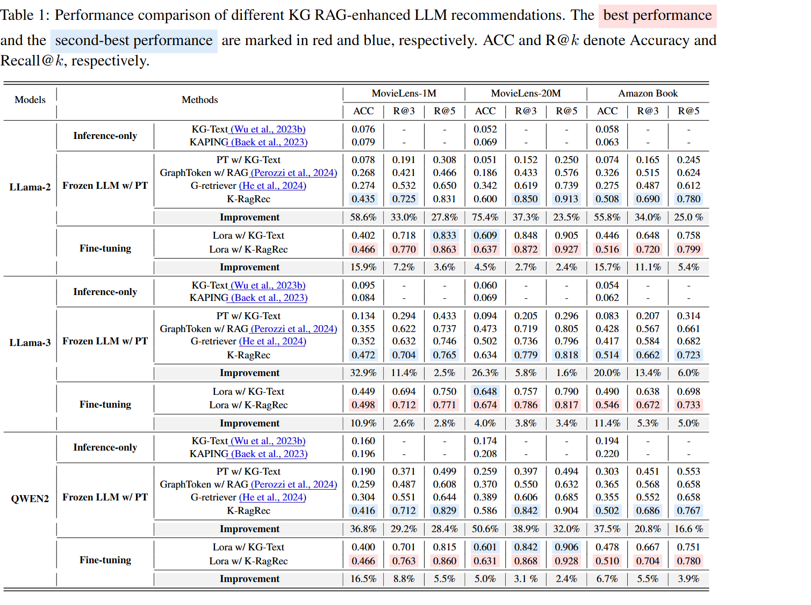

开头说是做推荐系统的，实际上从我的角度看，推荐系统和检索系统原理没有特别大的差异，不同的地方在于输入的内容有区分，检索系统的query用户输入的目的性更强，
而推荐系统需要根据用户画像等其他信息检索用户可能需要的内容。因此两者的输入format有所不同。
# Abstract
没啥干货，只说基于llm的推荐系统继承了backbone的缺陷，比如幻觉和知识过时，接着说他们做了基于llm的推荐，K-RagRec

# Introduction

作者提起了两个RAG的概念
Vanilla RAG 和Agentic RAG。

Vanilla RAG指的是我们传统认知的RAG，chunking、embedding、retrieval这类流程

Agentic RAG在Vanilla RAG的基础上， 加入一个Agent层控制检索和决策过程。
有点无语，vanilla这名字有点莫名其妙

# Method

U是用户的集合, V是商品的集合， 定义
$V^{u_i} = \{ v_1^{u_i}, v_2^{u_i}, ... , \}$是一个用户交互的序列，也就是这个用户先后和v1,v2..进行交互，比如点击或者下单
我们的目标是从候选的商品集合里选出用户可能喜欢的商品，如果规模为M，则它由一个正样本和M-1个负样本构成

作者首先采用一个预训练的模型，将节点输入，得出d维的节点语义信息，和d维的关系信息。
为了得到结合粗细粒度的知识，作者把不同距离的节点输入到GNN里，这样可以得到子图的表征。

然后就需要处理检索过程了

首先把query经过相同的PLM，得到同样长度的表征，之后取top-K，得到最相似子图，之后使用LLM做rerank
之后又通过一个GNN，将排序后的子图得到embedding，拼接后过一个MLP，接上query做回答。

说实话感觉有点扯，没有美感，有点硬堆砌的感觉，从效果上来说，这个流程首先检索到了最相似的几个子图，之后通过拼接操作将子图的全局信息放在LLM里，
但是首先来说，你前面用的PLM就起决定性要素，其次的话，GNN巡一个也费劲，失去了KG的优势，我图谱一直在变，那你子图的embedding是不是还得重新算，
取几跳的邻居也是个工程难点，泛化性不够好。但是不可否认的是这个工作做的很好，虽然我没想到有什么空间，但是肯定能改善，主要是GNN这套太笨重了。

# Experiment

数据集  
1. MovieLens-1M,包含了电影和文字描述、评分
2. MovieLens-20M 同上，规模更大
3. Amazon Book 10M的用户对书籍评分，以及书的标题

baseline
1. Retrieve-Rewrite-Answer
2. KAPING: 检索子图并文字化

实验流程
1. 2*A6000 48G， 训一个SentenceBert 做实体、关系、query的编码器
2. 训3层 Graph Transformer用于 MovieLens1M， 4层用于其他俩

