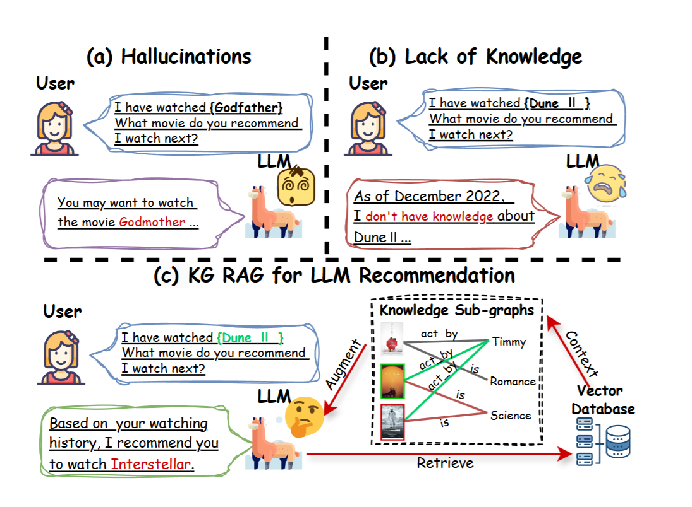
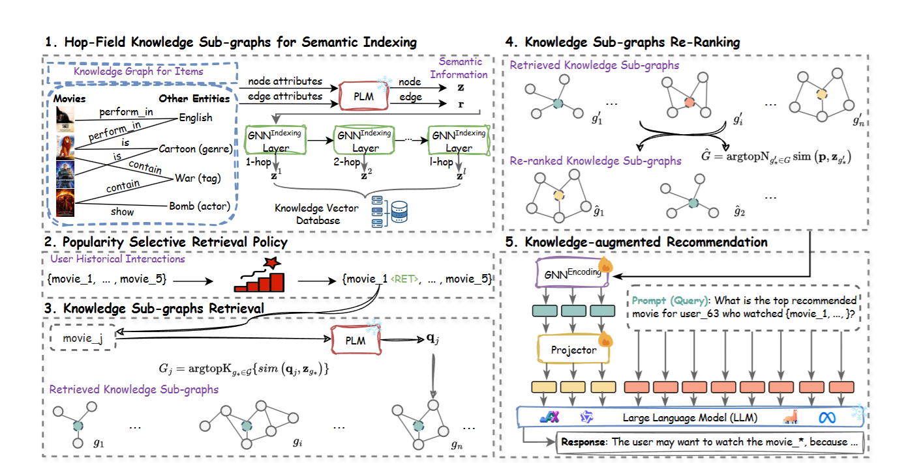

开头说是做推荐系统的，实际上从我的角度看，推荐系统和检索系统原理没有特别大的差异，不同的地方在于输入的内容有区分，检索系统的query用户输入的目的性更强，
而推荐系统需要根据用户画像等其他信息检索用户可能需要的内容。因此两者的输入format有所不同。
# Abstract
没啥干货，只说基于llm的推荐系统继承了backbone的缺陷，比如幻觉和知识过时，接着说他们做了基于llm的推荐，K-RagRec

# Introduction

作者提起了两个RAG的概念
Vanilla RAG 和Agentic RAG。

Vanilla RAG指的是我们传统认知的RAG，chunking、embedding、retrieval这类流程

Agentic RAG在Vanilla RAG的基础上， 加入一个Agent层控制检索和决策过程。
有点无语，vanilla这名字有点莫名其妙

# Method

