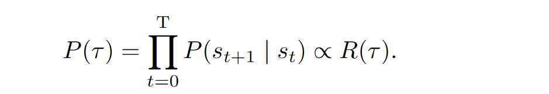
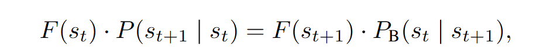
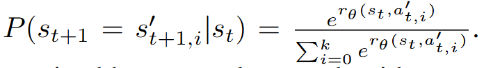
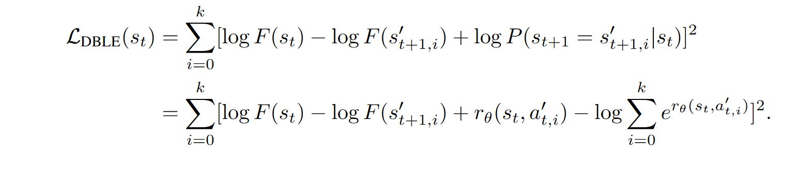

# Abstract

RAG结合知识图谱的方法目前处理复杂query的能力不行， 常见的方法是采用 Process Reward Model，将基于KG的查询变为多步骤的决策过程。但是PRM严重依赖步骤级别的监督信号，并且在KG里很难得到。

作者提出了GraphFlow，可以从**富文本**的KG里高效得到准确和多样的知识。GF采用了采用详细的平衡目标和局部探索来联合优化检索策略和流量估计器。

评测集： STaRK,包含现实世界的复杂查询， 结果显示GF在强模型上获得了10%的提升，在没见过的KG上也保持了强泛化性。

## 问题
1. 什么是PRM
2. GF的学习策略具体是什么
3. STaRK数据集的详细参数

# Introduction
主要通过示例“ 学校A发表的关于领域B的文章有哪些” 展示了一个困境，即KG-RAG面临着需要深刻理解作者、机构和文章之间的关系，也就是难以处理关系和文本知识的融合。另一个挑战就是检索目标的多样性。复杂的查询可能会搜索一组可能的候选，而不是单个的结果。

为了平衡准确性和多样性， PRM用来给出步长级别的引导。但是，训练PRM需要高质量的偏好数据，并且要有步级别的奖励信号，因此十分昂贵。

作者提出了GF，受GFlowNet启发， GF将检索过程形式化为一种检索策略的学习过程，这个模型可以生成带有概率分布的检索轨迹，概率高的选项在多样性和准确性表现更好。因此，作者共同训练了检索策略和流评估器，也就是给部分轨迹分配一个非负值。
这些流值可以视为总奖励在中间步骤的分解，并且可以不用训练就得到步长级别的监督信号。

# Related Work

1. KG-based RAG： 跳过
2. Process Reward Models

    和PPO差不多， 数据集由 对于状态s的正负操作p，n组成，造数据的时候可以用人类监督，规则启发或者模型标注。PRM的目标是寻一个得分函数，给基于状态的动作打分。

# Method 

**Problem Formulation**: 给一个输入q， 目标是得到KG {V，E，D} 中得到一个 K个节点的集合 V‘，V是节点集合，E是边集合，D是和节点关联的文档。

**Agent-Based Retrieval as a Multi-step Decision Process**: 
- 状态： s0 = {q, {D0}} 作为初始化，在第t步， st= {q, {D*}}， D*是不断收集的文档集合
- 动作： 从Vt 移动到邻接节点 Vt+1,并得到关联文档 Dt+1
- 转移： st转移到D*取得的信息已经足够回答问题，或者达到长度限制
- 奖励： 奖励函数对轨迹打分， 和终点Vt关联的Dt是否满足查询条件

**Energy-based Modeling for Accurate and Diverse Retrieval**

也就是说，对于轨迹tau的概率应该是轨迹中节点概率的累积与奖励函数的相关。

**Flow Estimation as Credit Assignment**
对于上面的公式，如何求得 P(st+1|st)，一般都分配R（tau），这么做会有分配性的问题。作者采用的方法是采用前后向的传播

也就是加入一个流评估函数F， 前向过程为F(st) * P(st+1|st)反向过程为 F(st+1) * P(st|st+1),两者相等

**Detailed Balance with Local Exploration** 
对于轨迹中的每一个非终止状态， 我们可以知道它的真实的下一个节点，在领域中采样k个邻居，组成了k+1个候选转移
前向的概率定义为， $r_{\theta}$ 这个给状态/动作赋值的函数就是我们要训练的目标
因为检索的过程不可逆，因此反向的概率Pb(st|st+1)应该是1，化简公式，两边取对数，得到对于模型的损失函数

# Experiment
- Dataset
  1. STaRK-AMAZON is an e-commerce KG where the nodes contain detailed product information and the edges denotes the properties of products and co-purchase between products.
The retrieval task is to retrieve the diverse products to satisfy the recommendation query.
  2. STaRK-MAG is an academic graph constructed based on OGB [24] and Microsoft Academic Graph [66]. The nodes contain author information, institute, and publications. The
retrieval task is to address academic queries such as paper searching.
  3. STaRK-PRIME is a biomedical KG where the nodes are associated with the detailed
description of drugs, disease, genes, and pathways, and the edges are their relationship. The
retrieval task is to address the biomedical query